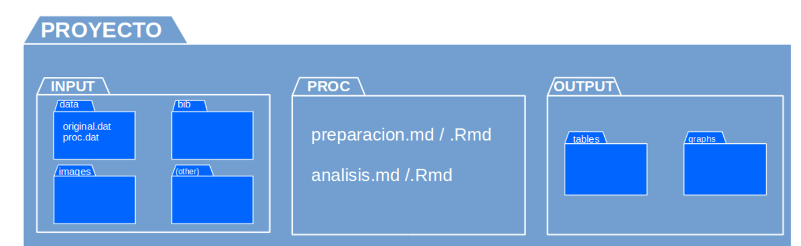
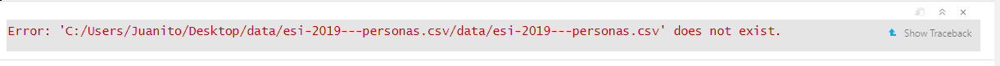
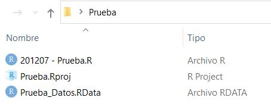
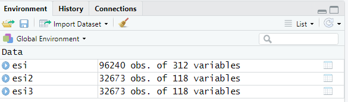
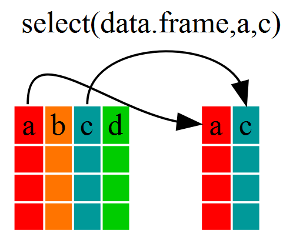

class: center, middle

.linea-superior[]
.linea-inferior[]


## Capacitación en R

## Procesamiento de bases de datos (1)

### Diciembre 2020

```{r setup, include=FALSE}
options(htmltools.dir.version = TRUE)
knitr::opts_chunk$set(message = FALSE) 
```

```{r xaringan-themer, include=FALSE, warning=FALSE}
library(xaringanthemer)
```

---

background-image: url("imagenes/fondo2.PNG")
background-size: contain;
background-position: 100% 0%

# Contenidos de hoy

El objetivo de esta sesión es aprender a manipular data frames.

Para cumplir con el objetivo, revisaremos los siguientes temas:

--

- Importación de datos desde distintos formatos a R.

--

- Introducción a **dplyr**.

--

- Manipulación básica de columnas (`select()`, `rename()`).

--

- Manipulación básica de filas (`arrange()`, `filter()`).

--

- Herramientas básicas de edición de datos (`if_else()`, `mutate()`).

--


Antes... revisaremos el **protocolo IPO** para organizar nuestro trabajo.

---

background-image: url("imagenes/IPO.PNG")
background-size: cover
class: center, bottom, inverse

---

background-image: url("imagenes/fondo2.PNG")
background-size: contain;
background-position: 100% 0%

# Protocolo IPO

El protocolo [IPO](https://juancarloscastillo.github.io/ipo/index_es.html) es una plantilla de carpetas de proyecto basada en el protocolo [TIER](https://www.projecttier.org/).

--

Se basa en generar un conjunto de archivos auto-contenidos organizado en una estructura de proyecto que cualquier persona pueda compartir y ejecutar. 

--

.medium-par[En vez de compartir nuestro código, compartimos una gran carpeta con el código, los archivos de entrada (INPUT) y los archivos de salida (OUTPUT). De esta forma, otro investigador podrá "reproducir" nuestro procesamiento o análisis.]

--



--

.medium-par[Cuando utilizemos Rmarkdown esto será fundamental...]

---

background-image: url("imagenes/fondo2.PNG")
background-size: contain;
background-position: 100% 0%

# Directorios de trabajo

Por ahora nos deja planteado el tema de la fijación de **directorios relativos**.

--

El directorio o carpeta de trabajo es el lugar en nuestra computadora donde R buscará archivos para importarlos y al que serán exportados.

Para identificar cuál es la ruta del directorio que está usando R se debe utilizar la función `getwd()`.

```{r, warning=FALSE}
getwd()
```

--

Es posible cambiar el directorio de trabajo usando la función `setwd()`.

```{r, warning=FALSE, eval=FALSE}
#setwd("C:/Users/nicol")
```

```{r warning=FALSE, eval=FALSE, results=FALSE, echo=FALSE}
#setwd("C:/Users/nicol/OneDrive - Instituto Nacional de Estadisticas/GitHub/Capacitaciones R al DET/sesion_2")
```

--

Cuando R esta cerrado, y uno abre un projecto o *script*, se fijará como directorio de trabajo la carpeta en la que se encuentra este código.

---

background-image: url("imagenes/fondo2.PNG")
background-size: contain;
background-position: 100% 0%

# Directorios de trabajo

Recomendación: en los códigos nunca alterar el directorio de trabajo. Dejar que el directorio se fije según la carpeta en la que tenemos nuestro *script*.

--

Esto permite que el código corra sin problemas en cualquier computador. 

--

Cuando queremos importar una base de datos no establecemos el **directorio absoluto**, el cuál en general contiene el nombre personal de la computadora (en nuestro caso `C:/Users/nicol...`).

--

Simplemente le decimos *"busca el archivo X en la carpeta `input` o `data` del proyecto que tenemos abierto"*. Es un **directorio relativo**:

```{r warning=FALSE}
library(readr)
esi <- read_csv2("data/esi-2019---personas.csv")

```

--

En mi computadora, que tiene el directorio `C:/Users/nicol...`, no abriría un archivo que está con la ruta de Juanito: `C:/Users/Juanito/Desktop/data/esi-2019---personas.csv`.




---

background-image: url("imagenes/fondo2.PNG")
background-size: contain;
background-position: 100% 0%

# R Projects

Otra forma de solucionar el problema de los directorios absolutos y la replicabilidad de códigos en distintos computadores, es el uso de **R Projects** (`Rproj`).

--

El `Rproj` cumple la misma función que la **definición de un directorio de trabajo** mediante el comando *setwd()*, sólo que **de forma automática**, sin tener que escribir o modificar *absolutamente nada* del código original.

---

background-image: url("imagenes/fondo2.PNG")
background-size: contain;
background-position: 100% 0%

# R Projects

Para crear un **R Project**, debemos pinchar en: File > New Project...

.center[]

--
La recomendación es seleccionar *Existing Directory* y definir la carpeta con la que estamos trabajando como directorio de trabajo. 

---

background-image: url("imagenes/fondo2.PNG")
background-size: contain;
background-position: 100% 0%

# R Projects

RStudio creará inmediatamente un archivo con el nombre de la carpeta y con terminación `.Rproj` en su interior. 

--

**La presencia de ese archivo** al interior de la carpeta hará que RStudio **inmediatamente defina esa carpeta como directorio de trabajo**.

--

De esta forma, si queremos compartir una programación, **la otra persona no tendrá que modificar *absolutamente nada* ** en el código. Con el sólo hecho de abrir el archivo `.Rproj`, RStudio usará esa carpeta como directorio de trabajo.


---

background-image: url("imagenes/fondo2.PNG")
background-size: contain;
background-position: 100% 0%

# R Projects

Pensemos que esta es nuestra carpeta de trabajo.

--

.left[]

--

Y al interior del script .R tenemos la siguiente línea de código.

```{r, eval=FALSE} 
prueba <- load("Prueba_Datos.RData")
```

El código abrirá el archivo "Prueba_Datos.RData" en cualquier computador, sin rutas, dada la presencia del archivo `.Rproj` al interior de la carpeta.

---

background-image: url("imagenes/import.jpg")
background-size: cover
class: center, bottom, inverse

# Importación de datos

---

background-image: url("imagenes/fondo2.PNG")
background-size: contain;
background-position: 100% 0%

# Importación de datos

**R** tiene distintos paquetes para importar datos, diferenciando la extensión
de los archivos.

--

Estos archivos pueden ser asignados a un objeto.

--

En esta sesión veremos como importar:

    - Archivos de STATA (.dta) y de SPSS (.sav).
    
    - Archivos de texto plano delimitados (.csv).
    
    - Archivos de excel (.xlsx, .xls).
--
Para importar archivos guardados desde STATA o SPSS, existe el paquete `haven`.


.center[]

---

background-image: url("imagenes/fondo2.PNG")
background-size: contain;
background-position: 100% 0%

# Importación de datos

El paquete **`haven`** forma parte del universo de **`tidyverse`**, pero a 
diferencia de otros paquetes de ese universo, es necesario cargar la librería
para poder usar las funciones asociadas.

--

Las funciones incluídas consideran un lenguaje bastante explícito:

- STATA: `read_dta()` permite importar archivos con extensión ".dta".

- SPSS: `read_sav()` permite importar archivos con extensión ".sav".

--

```{r, warning=FALSE, eval=FALSE}
library(haven)
# El archivo se puede cargar desde una carpeta según ruta absoluta
esi <- read_dta(file = "C:/Users/usuario/Desktop/esi-2019---personas.dta")
# El archivo se puede cargar desde una carpeta según ruta relativa
esi <- read_dta(file = "data/esi-2019---personas.dta")
# ...o desde un sitio web
esi <- read_sav(file = "http://www.ine.cl/docs/default-source/encuesta-suplementaria-de-ingresos/bbdd/spss_esi/2019/esi-2019---personas.sav")
```

--

El argumento "file" indica la ruta y el nombre del archivo a importar a **R**. La dirección del archivo debe utilizar **forward-slash** ("/") en vez de **backslash** ("\").

---

background-image: url("imagenes/fondo2.PNG")
background-size: contain;
background-position: 100% 0%

# Importación de datos

- Importación de archivos de texto plano delimitados

--

Si el archivo que queremos importar corresponde a un archivo de texto plano 
delimitado, el universo de `tidyverse` cuenta con el paquete **`readr`**.

--

Entre las funciones de `readr` se encuentran:

  - **`read_csv()`**: se utiliza para importar archivos delimitados por coma.
    
  - **`read_csv2()`**: se utiliza para importar archivos delimitados por punto 
  y coma. Este tipo de delimitación se utiliza cuando la coma se utiliza para 
  separar números decimales.
    
  - **`read_delim()`**: se utiliza para importar archivos planos con cualquier 
    delimitador. Al usar esta función es necesario definir el argumento 
    `delim`, para identificar el tipo de delimitador.

--

Todas estas funciones tienen una sintaxis similar.

```{r, warning=FALSE, eval=FALSE}
library(readr)
## descargar base de https://www.ine.cl/estadisticas/sociales/ingresos-y-gastos/encuesta-suplementaria-de-ingresos
esi <- read_csv2(file = "data/esi-2019---personas.csv")
```

---

background-image: url("imagenes/fondo2.PNG")
background-size: contain;
background-position: 100% 0%

# Importación de datos

Estas funciones emplean la primera fila de los datos para los nombres de las 
columnas.

--

En caso de que los datos no incluyan los nombres, se puede agregar el argumento 
`col_names` = FALSE, y la función entenderá que se deberán crear nombres 
ficticios, etiquetados secuencialmente desde X1 a Xn.

--

- Importación de archivos de Excel

--

El paquete `readxl` nos permite importar archivos de Excel.

Una de sus funciones es `read_excel()`, y al igual que las funciones vistas 
previamente, se debe definir el argumento donde se encuentra el archivo, que 
en esta función se llama `path`.

A diferencias de los otros tipos de archivos que hemos visto, los libros de 
excel pueden contar con más de una hoja; el argumento `sheet` se utiliza para 
definir hoja que se importará.

```{r, warning=FALSE, eval=FALSE}
library(readxl)
esi <- read_excel(path = "data/esi-2019---personas.xlsx",
                  sheet = "Hoja1")
```

---

background-image: url("imagenes/fondo2.PNG")
background-size: contain;
background-position: 100% 0%

# Importación de datos

- Importación de archivos de R

--

Los archivos de R poseen la extensión ".RData".

--

La función `load()` se utiliza para cargar el archivo.

--

No es necesario cargar librerías para poder utilizar la función.

--

No se debe asignar el valor al objeto a cargar.

--

**Importante**: estos archivos pueden incluir más de un objeto.


```{r, warning=FALSE, eval=FALSE}
#esi <- read_csv2(file = "data/esi-2019---personas.csv")
#esi2 <- read_csv2(file = "data/esi-2019---hogares-sin-becas.csv")
#esi3 <- read_csv2(file = "data/esi-2019---hogares-con-becas.csv")
#save(esi,esi2,esi3, file = "data/esi-2019.RData")
load(file = "data/esi-2019.RData")
```



---

background-image: url("imagenes/fondo2.PNG")
background-size: contain;
background-position: 100% 0%

# Importación de datos

Un pequeño ejercicio...

- Cargue el archivo "ene-2019-11.csv" (se utiliza "," para separar los valores)

- Asigne al objeto "ene" el archivo cargado.

- Identifique la clase del objeto "ene".

- Identifique las dimensiones del objeto "ene".

--

```{r, warning=FALSE}
library(readr)
ene <- read.csv(file = "data/ene-2019-11.csv")
class(ene)
dim(ene)
```

---

background-image: url("imagenes/transformer.gif")
background-size: cover
class: center, bottom, inverse

# Transformación de datos

---

background-image: url("imagenes/fondo2.PNG")
background-size: contain;
background-position: 100% 0%

# Transformación de datos

## El paquete `dplyr`

.pull-left[

Para la manipulación de los data frames existe un paquete llamado **`dplyr`**.

Este paquete fue desarrollado por Hardley Wickman de RStudio.

Es una versión optimizada de un paquete anterior llamado `plyr`.
 
El paquete `dplyr` proporciona una "gramática" (particularmente verbos) para la 
manipulación y operaciones con data frames.
 
Los paquetes `dplyr`, `readr`, `readxl` y `haven` forman parte del universo de 
[`tidyverse`](https://www.tidyverse.org).

]

.pull-right[
.center[

]
]

---

background-image: url("imagenes/fondo2.PNG")
background-size: contain;
background-position: 100% 0%

# Transformación de datos

Durante esta sesión veremos algunas funciones del paquete **`dplyr`**, que se 
utilizan para la manipulación de data frames.

--

**Manipulación básica de columnas**

--

- **`select()`**: selecciona y devuelve un conjunto de columnas.

--

- **`rename()`**: renombra variables en un data frame.

--

**Manipulación básica de filas**

--

- **`arrange()`**: reordena filas de un data frame.

--

- **`filter()`**: selecciona y devuelve un conjunto de filas según una o varias 
condiciones lógicas.

--

**Herramientas básicas de edición de datos**

--

- **`if_else()`**: evaluación de condiciones, y asignación de valores.

--

- **`mutate()`**: añade nuevas variables o transforma variables existentes.

---

background-image: url("imagenes/fondo2.PNG")
background-size: contain;
background-position: 100% 0%

# Transformación de datos

Todas estas funciones tienen en común una serie de argumentos:

--

- El primer argumento es el data frame a manipular.

--

- Los otros argumentos describen qué hacer con el data frame especificado en el 
primer argumento.

--

- El valor de retorno de la función es un nuevo data frame.

--

Estas funciones serán algunas de nuestras mejores compañeras y siempre nos 
acompañarán en nuestro camino de programación.

--

Como veremos en esta sesión, una de las principales ventajas de estas funciones 
es que podemos referirnos a las columnas en el data frame directamente sin 
utilizar el operador "**$**", es decir, solo con el nombre de la variable.

---

background-image: url("imagenes/fondo2.PNG")
background-size: contain;
background-position: 100% 0%

# Transformación de datos

## Función **`select()`**

--

Esta función es utilizada para seleccionar columnas dentro de un data frame.

--

El resultado de esta función corresponde a un data frame que solo incluye las 
variables seleccionadas.

--

El orden de las variables corresponde al orden seleccionado.

--

.center[

]

---

background-image: url("imagenes/fondo2.PNG")
background-size: contain;
background-position: 100% 0%

# Transformación de datos

## Función **`select()`**

Existen múltiples formas de seleccionar las columnas utilizando esta función.

--

- Selección de las columnas a través del nombre de los campos.

--

```{r}
library(dplyr)
head(select(ene, ano_encuesta, mes_encuesta, cae_especifico, b1, b14_rev4cl_caenes),
     n = 3) # el argumento n corresponde a la función "head"
```

--

- Selección de las columnas a través de la posición que ocupan en el data frame.

--

```{r}
head(select(ene, 1, 2, 3, 4, 5),
     n = 3)
```

---

background-image: url("imagenes/fondo2.PNG")
background-size: contain;
background-position: 100% 0%

# Transformación de datos

## Función **`select()`**

- Selección de las columnas a través de rangos.
    - Estos rangos se pueden definir a través de los nombres de campos o de las 
    posiciones.

--

```{r}
head(select(ene, c(idrph:mes_central)), n = 3)
```

--

- Selección negativa utilizando el signo "-" antes de la variable.
    - Consiste en seleccionar las variables que no queremos en la base final.

--

```{r}
head(select(ene, -c(4:length(ene))), n = 3)
```

---

background-image: url("imagenes/fondo2.PNG")
background-size: contain;
background-position: 100% 0%

# Transformación de datos

## Función **`select()`**

A continuación un resumen de las principales funciones auxiliares que se pueden 
utilizar con `select()`:

- "**-**": se utiliza para identificar los campos a excluir de la selección.

- "**:**": se utiliza para definir un rango.

- **contains()**: selecciona variables cuyo nombre contiene la cadena de 
texto definida.

- **ends_with()**: selecciona variables cuyo nombre termina con la cadena de 
texto definida,

- **start_with()**: selecciona variables cuyo nombre comienza con la cadena de 
texto definida,

- **matches()**: selecciona las variables cuyos nombres coinciden con una 
[*expresión regular*](https://rpubs.com/ydmarinb/429756).

---

background-image: url("imagenes/fondo2.PNG")
background-size: contain;
background-position: 100% 0%

# Transformación de datos

Dos pequeños ejercicios...

--

- Seleccione las variables idrph, edad, sexo, cine.
  
--

```{r}
head(select(ene, idrph, edad, sexo, cine), n = 3)
```

--

- Seleccione la variable idrph y las variables que terminen en "caenes"

--
  
```{r}
head(select(ene, idrph, ends_with("caenes")), n = 3)
```

---

background-image: url("imagenes/fondo2.PNG")
background-size: contain;
background-position: 100% 0%

# Transformación de datos

## Función **`rename()`**

--

Si necesitamos renombrar una variable (columna) de un data frame, existen 
múltiples formas y varias muy complejas.

--

La función `rename()` permite editar el nombre de una variable de una manera 
sencilla, y sin afectar al resto de variables.

--

Esta función permite renombrar más de una variable a la vez.

--

Si queremos obtener el nombre de las variables de un data frame, se utiliza la 
función `names()`

---

background-image: url("imagenes/fondo2.PNG")
background-size: contain;
background-position: 100% 0%

# Transformación de datos

## Función **`rename()`**

A continuación se mostrarán dos formas de renombrar variables...

--

```{r}
ene_5 <- select(ene, idrph, edad, sexo, cine)
names(ene_5)
```

--

...a través del lenguaje base

--

```{r}
names(ene_5)[names(ene_5) == "sexo"] <- "sex"
names(ene_5)
```

--

...a través de `rename()`

--

```{r}
names(rename(ene_5, identificador = idrph, niveleducacional = cine))
```

---

background-image: url("imagenes/fondo2.PNG")
background-size: contain;
background-position: 100% 0%

# Transformación de datos

## Uso de **pipes** (**`%>%`**)

Como hemos visto hasta ahora, estas funciones siguen la misma estructura:

    - Primer argumento: data frame sobre el que se aplica la función.
    
    - Resto de argumentos: elementos del data frame sobre los cuales actua
    la función.
    
--

Lo anterior nos puede hacer pensar: **¿es posible encadenar estas funciones?**.

--

Si...
--
si se puede, utilizando el operador **`%>%`** (llamado **pipe**).

---

background-image: url("imagenes/pipes.jpg")
background-size: cover
class: center, bottom, inverse

---

background-image: url("imagenes/fondo2.PNG")
background-size: contain;
background-position: 100% 0%

# Transformación de datos

## Uso de **pipes** (**`%>%`**)

El operador **%>%** nos permite tomar el resultado de una función y mandarlo 
directamente a la siguiente función, concatenando acciones.

--

Se puede leer como "luego" o "a continuación".

--

Este operador nos ayudará enormemente a mejor la legibilidad de un código.

--

El atajo en Windows para escribir `pipes` es: ctrl + shift + m.

En Mac es: cmd + shift + m

---

background-image: url("imagenes/fondo2.PNG")
background-size: contain;
background-position: 100% 0%

# Transformación de datos

## Uso de **pipes** (**`%>%`**)

Para utilizar los pipes, es necesario seguir la siguiente estructura:

```{r, warning=FALSE, eval=FALSE}
df %>% # data frame sobre el que se ejecutará la función
  funcion() %>% # esta función se aplica sobre el data frame "df"
  funcion() # esta función se aplica sobre el resultado de la función anterior
```

--

Utilizando pipes, el resultado del ejercicio de renombrar es posible escribirlo 
de la siguiente manera:

--

```{r}
ene_6 <- ene %>%
  select(idrph, edad, sexo, cine) %>%
  rename(identificador = idrph, niveleducacion = cine)
names(ene_6)
```

---

background-image: url("imagenes/fondo2.PNG")
background-size: contain;
background-position: 100% 0%

# Transformación de datos

## Función **`filter()`**

--

Esta función se utiliza para filtrar un data frame según alguna condición a 
definir.

--

Así como la función `select()` es utilizada para seleccionar columnas de un 
data frame, la función `filter()` es utilizada para seleccionar las filas de 
un data frame.

--

.center[

]

---

background-image: url("imagenes/fondo2.PNG")
background-size: contain;
background-position: 100% 0%

# Transformación de datos

## Función **`filter()`**

Al aplicar esta función, los resultados que quedarán en el dataframe resultante 
serán solo aquellos en los que se cumpla la condición definida. Por ejemplo...

--

...el número de filas del data frame "ene" es:

--

```{r}
dim(ene)
```

--

...mientras que el número de filas del data frame "ene" que corresponde al mes 
de encuestaje de diciembre es:

--

```{r}
dim(ene %>% filter(mes_encuesta == 12))
```

---

background-image: url("imagenes/fondo2.PNG")
background-size: contain;
background-position: 100% 0%

# Transformación de datos

## Función **`filter()`**

Las condiciones para filtrar un data frame pueden ser construidas mediante 
operadores relacionales.

--

A continuación se presenta un listado de operadores relacionales:

--

- "**<**": menor que
- "**>**": mayor que
- "**==**": igual que
- "**<=**": menor o igual que
- "**>=**": mayor o igual que
- "**!=**": diferente que
- "**%in%**": pertenece al conjunto
- "**is.na**": es NA
- "**!is.na**": no es NA

---

background-image: url("imagenes/fondo2.PNG")
background-size: contain;
background-position: 100% 0%

# Transformación de datos

## Función **`filter()`**

¿Es posible filtrar un data frame por más de una condición al mismo tiempo?

--

**Si**, es posible utilizando **operadores lógicos**.

--

Estos operadores se utilizan para analizar el valor de verdad de dos sentencias.

--

Algunos operadores lógicos o booleanos son:

--

- "**&**": conjunción y
- "**|**": conjunción o
- "**!**": operador no
- "**any**": al menos una sentencia es verdadera
- "**all**": todas las sentencias son verdaderas

---

background-image: url("imagenes/fondo2.PNG")
background-size: contain;
background-position: 100% 0%

# Transformación de datos

## Función **`filter()`**

Algunos ejemplos...

--

- Obtener el número de filas de registros con edad mayor a 50 y cuyo 
grupo ocupacional corresponde a profesionales científicos e intelectuales 
(b1 == 2).

--

```{r}
dim(ene %>% filter(edad > 50 & b1 == 2))
```

--

- Obtener el número de filas de registros que cumplan al menos una de las 
dos relaciones siguiente:
    
    - Mujeres (sexo == 2) de la región 6.
    - Hombres (sexo == 1) de la región 12.

--

```{r}
dim(ene %>% filter(sexo == 2 & region == 6 | sexo == 1 & region == 12))
```

---

background-image: url("imagenes/fondo2.PNG")
background-size: contain;
background-position: 100% 0%

# Transformación de datos

## Función **`arrange()`**

--

Esta función se utiliza para reordenar las filas de un data frame.

--

- El orden se puede realizar según una o más variables.

--

- El reordenamiento se realiza según el orden de las columnas seleccionadas.

--

- Por defecto, el orden es ascendente.

--

- Para ordenar de manera descendente se debe utilizar la función auxiliar 
`desc()`.

```{r}
library(guaguas)
head(guaguas %>% arrange(desc(n)), n = 3)
```

---

background-image: url("imagenes/fondo2.PNG")
background-size: contain;
background-position: 100% 0%

# Transformación de datos

Algunos ejercicios sobre lo visto hasta ahora en clases...

--

- Utilizando la base de guaguas, filtre según su año de nacimiento, su sexo de 
nacimiento, y luego ordene el resultado por la variable "n", de forma 
descendente.

- Utilice la función "head", con el argumento "n == 5", e identifique cuantos 
nombres de los 5 más repetidos comienzan con la letra "J".

--

```{r}
library(guaguas)
head(guaguas %>%
       filter(sexo == "M", anio == 1990) %>% # Hombres nacidos en 1990
       arrange(desc(n)), n = 5)
```

---

background-image: url("imagenes/fondo2.PNG")
background-size: contain;
background-position: 100% 0%

# Transformación de datos

## Función **`mutate()`**

Esta función tiene la finalidad de realizar transformaciones sobre los valores 
de un data frame.

--

Algunas de las transformaciones posibles son:

--

- Cambiar el formato de una variable.

Por ejemplo: modificar el formato de la variable "idrph" a character.

--

```{r}
class(ene$idrph)
```

--

```{r}
ene <- ene %>% mutate(idrph = as.character(idrph))
```

--

```{r}
class(ene$idrph)
```

---

background-image: url("imagenes/fondo2.PNG")
background-size: contain;
background-position: 100% 0%

# Transformación de datos

## Función **`mutate()`**

- Modificar el valor de alguna variable.

--

Esta función también nos permite crear nuevas variables en un data frame.

--

Con esta función se pueden combinar funciones básicas para realizar operaciones 
sobre las variables.

--

Con `mutate()` podemos editar y/o crear más de una variable. Es necesario 
separar las instrucciones entre variables con una coma.

--

Al trabajar sobre más de una variable, la función primero trabajará sobre 
la primera instrucción previa a la primera coma que separe las instrucciones, 
luego, avanzará sobre la siguiente.

---

background-image: url("imagenes/fondo2.PNG")
background-size: contain;
background-position: 100% 0%

# Transformación de datos

## Función **`mutate()`**

Ejemplo

--

```{r}
df <- data.frame(x = c(1, 2),
                 y = c(5, 5))
print(df)
```

--

```{r}
df <- df %>%
  mutate(y = 10,
         z = x*y)
print(df)
```

---

background-image: url("imagenes/fondo2.PNG")
background-size: contain;
background-position: 100% 0%

# Transformación de datos

## Función **`mutate()`**

--

Como pudimos ver, las variables creadas son agregadas al final del data frame.

--

¿Es posible definir la posición donde serán agregadas?

--

Si, agregando el argumento ".before" o el argumento ".after".

--

```{r}
df <- df %>% mutate(w = "ejemplo", .before = x)
print(df)
```

--

El paquete `dplyr` también cuenta con la función `relocate()` que nos permite 
ordenar algunas columnas dentro de un data frame.

```{r}
df %>% relocate(c(w, z), .after = x)
```

---

background-image: url("imagenes/fondo2.PNG")
background-size: contain;
background-position: 100% 0%

# Transformación de datos

## Función **`mutate()`**

Hasta ahora hemos visto como crear variables donde todas las filas cumplan las 
mismas condiciones, pero no siempre es así. **¿Cómo podemos trabajar cuando **
**la creación de una variable depende del valor de otra?**

--

Por ejemplo:

--

    - Si la variable sexo es igual a 1, asigne tal valor, en cambio, si la 
    variable sexo es igual a 2, asigne otro valor.
    
    - Si la variable región es igual a 1, 15, 2, la variable zona tendrá el 
    valor "norte", en cambio si la variable es igual a 12, la variable zona 
    tendrá el valor "sur".

--

Esto se puede realizar utilizando una función llamada `if_else()`, cuyo 
objetivo es evaluar el valor de verdad de una sentencia, y luego entregar un 
resultado según ese valor. Esta función se puede utilizar junto a la función 
`mutate()`.

---

background-image: url("imagenes/fondo2.PNG")
background-size: contain;
background-position: 100% 0%

# Transformación de datos

## Función **`mutate()`**

La función `if_else()` trabaja con los siguientes argumentos:

--

- **condition**: corresponde a la sentencia a evaluar.

--

- **true**: indica el valor a asignar si la sentencia es verdadera.

--

- **false**: indica el valor a asignar si la sentencia es falsa.

--

- **missing**: indica el valor a asignar si la sentencia es missing.


---

background-image: url("imagenes/fondo2.PNG")
background-size: contain;
background-position: 100% 0%

# Transformación de datos

## Función **`mutate()`**

La función **if_else()** actúa sobre cada fila, y otorga un valor distinto a 
cada celda dependiendo del valor de verdad por fila.

Ejemplo: recodificar la categoría 10 de la variable b1 y asignarle el valor 0.

--

```{r}
ene <- ene %>% mutate(b1 = if_else(b1 == 10, 0, as.numeric(b1)))
table(ene$b1)
```

---

background-image: url("imagenes/fondo2.PNG")
background-size: contain;
background-position: 100% 0%

# Transformación de datos

## Función **`mutate()`**

Entre las funciones básicas de R, existe la función `ifelse()`, la cual es 
menos estricta que `if_else()`, pero no tiene un tratamiento especial para los 
missings.

--

La función `ifelse()` base solo trabaja con tres argumentos: "test", "yes" y 
"no".

--

```{r}
df2 <- data.frame(x = c(1, 2, NA))
```

--

```{r}
df2 %>% mutate(y = if_else(condition = (x == 1), true = "valido", 
                           false = "no valido", missing = "missing"))
```

--

```{r}
df2 %>% mutate(y = ifelse(test = (x == 1), yes = "valido", no = "no valido"))
```

---

background-image: url("imagenes/fondo2.PNG")
background-size: contain;
background-position: 100% 0%

# Transformación de datos

Algunas funciones importantes que se pueden utilizar en conjunto con `mutate()` 
son:

--

- La función `sum()`: utilizada para sumar los valores de una variable (suma 
de la columna).

- La función `row_number()`: utilizada para asignarle un valor a cada fila 
igual a la posición que ocupan en el data frame.

- La función `mean()`: utilizada para obtener la media de una columna.

- La función `max()`: utilizada para obtener el valor máximo de una variable.

- La función `paste()`: utilizada para concatenar variables y/o strings.

- La función `gsub()`: utilizada para reemplazar el valor de texto dentro de 
una variable.

- La función `nchar()`: utilizada para contar el número de caracter de una 
variable.

---

background-image: url("imagenes/fondo2.PNG")
background-size: contain;
background-position: 100% 0%

# Transformación de datos

A continuación, un ejemplo...

--

```{r}
df4 <- data.frame(x1 = c(1, 2, 3, 4, NA),
                  x2 = c(5, 13, -2, 1, 5),
                  x3 = c("y_1", "y_2", "y_3", "y_4", "y_5"))
df4 %>% mutate(
  total = sum(x1),
  total_x1 = sum(x1, na.rm = T), # con na.rm no se consideran los missing
  media_x2 = mean(x2),
  n_fila = row_number(),
  x3_v2 = gsub("y", "v", x3))
```

---

background-image: url("imagenes/fondo2.PNG")
background-size: contain;
background-position: 100% 0%

# Transformación de datos

## Ejercicio final

Cree el data frame df3...

```{r}
df3 <- data.frame(x = c(1, 2, NA, 5),
                  y = c(2, 4, 0, 15))
```

Luego...

- Edite la variable "x", de forma tal que el valor missing tome el valor 0.

- Genere la variable "division", que sea igual a la división entre "y" y "x".

- Filtre los casos donde division sea distinto de 2.

--

```{r}
df3 %>%
  mutate(x = if_else(is.na(x), 0, x),
         division = y / x) %>%
  filter(division != 2)
```

---

background-image: url("imagenes/fondo2.PNG")
background-size: contain;
background-position: 100% 0%

# Ejercicios para la 🏠

- Importar la base **ene-2019-11.csv**.

- Seleccionar las variables: idrph, edad, sexo, b1 y las variables cuyo nombre 
comienza con "cae_"

- Renombrar la variable *cae_especifico* por *cse_especifico*.

- Generar la variable *tipo_ocupado* en base a las siguientes reglas:

    - Asignarle el valor "presente" en caso que la variable cse_especifico
    se encuentre entre 1 y 4 (valores extremos incluidos).
    - Asignarle el valor "ausente" en caso que la variable cse_especifico 
    se encuentre entre 5 y 7 (extremos incluidos).
    - Asignarle el valor "no ocupado" en cualquier otro caso.
    
- Obtener el número de ocupados ausentes codificados como "Directivos y 
Gerentes" (b1 == 1).

---

background-image: url("imagenes/fondo2.PNG")
background-size: contain;
background-position: 100% 0%

# Referencias

Nada de esto sería posible sin:

- [`R fot Data Science, de Hadley Wickham`](https://r4ds.had.co.nz/)

- [`Advanced R, de Hadley Wickham`](http://adv-r.had.co.nz/Introduction.html)

- [`Data wrangling, exploration, and analysis with R, de Jenny Bryan`](https://stat545.com/index.html)

- [`Introduction to R, de Data Carpentry`](https://datacarpentry.org/R-genomics/01-intro-to-R.html#functions)

- [`Xaringan: Presentation Ninja, de Yihui Xie`](https://github.com/yihui/xaringan). Para generar esta presentación con la planilla ninja ⚔

R for Data Science tiene una traducción al español realizada por la comunidad hisp
ana de R:

- [`R para ciencia de datos, de Hadley Wickham`](https://es.r4ds.hadley.nz/)

---

class: center, middle

.linea-superior[]
.linea-inferior[]


## Capacitación en R y herramientas de productividad

## Proyecto Estratégico Servicios Compartidos para la Producción Estadística

## Procesamiento de bases de datos (1)

### Octubre 2020
